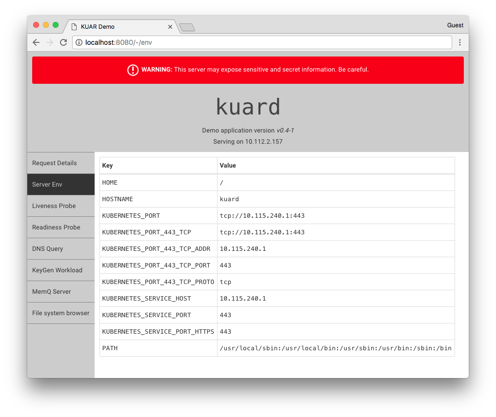

# practice-kuard
This repo contains code used for practicing how to code kuard project
- Original [repo](https://github.com/kubernetes-up-and-running/kuard.git)

--- 

# Demo application for "Kubernetes Up and Running"



### Running

```
kubectl run --restart=Nerver --images=thanhbinhdoan1993/kuar-demo/kuard-amd64:blue kuard
kubectl port-forward kuard 8080:8080
```

Open your browser to [http://localhost:8080](http://localhost:8080).

### Building

We have ~3 ways to build.
This has changed slightly from when the book is published so I'd view this as authoritative.

### Insert Binary

This aligns with what is in the book.
You need to build the binary to run *somehow* and then insert it into a Docker image.
The easiest way to do this is to use the fully automated make system to build the binary and then create a Dockerfile for creating an image.

Create the binary by typing `make` at the command line. This'll build a docker image and then run it to compile the binary.

Now create a minimal Dockerfile to contain that binary:

```
FROM alpine
COPY bin/blue/amd64/kuard /kuard
ENTRYPOINT [ "/kuard" ]
```

Overwrite `Dockerfile` with this and then run `docker build -t kuard-amd64:blue .`.
Run with `docker run --rm -ti --name kuard --publish 8080:8080 kuard-amd64:blue`.

To upload to a registry you'll have to tag it and push to your registry. Refer to your registry documentation for details.

#### Multi-stage Dockerfile

A new feature of Docker, since the book was published, is a "multi-stage" build.
THis is a way to run build multiple images and then copy files between them.